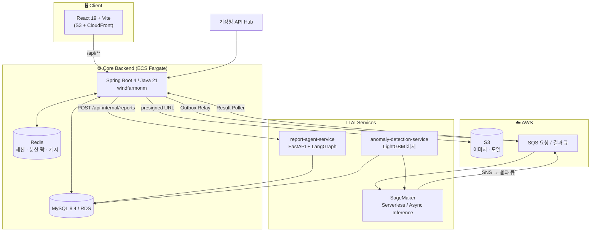

# 🌬️ WindFarm O&M — 풍력발전 통합 운영·정비 플랫폼

KT AIVLE School 9기 · AI TK8 · **Team 22** 빅프로젝트

SCADA 시계열 데이터와 드론 촬영 이미지를 함께 다루는 **풍력발전단지 O&M(Operation & Maintenance) 플랫폼**입니다.
발전량 모니터링, 이상 감지(Anomaly Detection), 블레이드 결함 탐지(Defect Detection), 그리고 LLM 에이전트 기반 정비 보고서 자동 생성까지 하나의 파이프라인으로 연결합니다.

> 대상 단지: **장흥**(U1~U6), **화순**(U1~U8)

---

## 📑 목차

- [핵심 기능](#-핵심-기능)
- [시스템 아키텍처](#-시스템-아키텍처)
- [기술 스택](#-기술-스택)
- [리포지토리 구조](#-리포지토리-구조)
- [로컬 실행 가이드](#-로컬-실행-가이드)
- [환경 변수](#-환경-변수)
- [API 개요](#-api-개요)
- [도메인 모델](#-도메인-모델)
- [AI/ML 파이프라인](#-aiml-파이프라인)
- [CI/CD](#-cicd)
- [브랜치 전략 & 컨벤션](#-브랜치-전략--컨벤션)

---

## ✨ 핵심 기능

| 도메인 | 기능 |
|---|---|
| **Identity** | 회원가입 / 로그인 / 이용약관 동의, Redis 세션 기반 인증 |
| **User Management** | 관리자 승인·거절, 권한(`ADMIN` / `MANAGER`) 관리, 강제 로그아웃, 감사 로그(Audit Log) |
| **Asset Management** | 발전단지·터빈·블레이드 자산 관리, SCADA 이력, 일/월 발전량 집계, 기상청(KMA) ASOS 날씨 연동 |
| **Monitoring & Diagnosis** | 2계층 이상 감지(급성 정지 / 만성 성능 저하), 이상 이벤트 알림 |
| **Defect Inspection** | 드론 이미지 S3 presigned 업로드 → SageMaker 비동기 추론 → 블레이드 결함·심각도 적재 |
| **Maintenance Reporting** | LangGraph 멀티 에이전트가 4종 보고서 자동 생성, Markdown 편집·삭제 |

---

## 🏗 시스템 아키텍처



### 요청 흐름 요약

1. **결함 진단** — 점검 생성 → S3 presigned URL 로 드론 이미지 업로드 → 업로드 완료 통보 → **Outbox 릴레이**가 SQS 요청 큐 적재 → 발사 폴러가 SageMaker Async Inference 호출 → SNS → 결과 큐 → 결과 폴러가 결함 적재 → 결함 진단 보고서 생성
2. **이상 감지** — `run_tier_a.py`(매시간) / `run_tier_b.py`(매일) 배치가 SCADA를 스코어링 → `anomaly_event` 적재 → 알림 발송, 24h 이상 지속 시 보고서 자동 생성
3. **보고서 생성** — Backend가 report-agent에 동기 위임 → LangGraph Supervisor → 유형별 Agent → Critic 검증/재시도 → Markdown 본문 반환

---

## 🛠 기술 스택

### Frontend
`React 19` · `Vite 6` · `React Router 7` · `Axios` · `Recharts` · `OpenLayers` · `Three.js (@react-three/fiber, drei)` · `react-markdown` · `lucide-react`

### Backend
`Java 21` · `Spring Boot 4.0` · `Spring Data JPA` · `Spring Session (Redis)` · `Flyway` · `MySQL 8.4` · `Redis` · `ShedLock` · `springdoc-openapi` · `AWS SDK v2 (S3 / SQS / SageMaker Runtime)` · `Testcontainers` · `ArchUnit`

### AI / ML
`FastAPI` · `LangGraph 1.x` · `LangChain 1.x` · `OpenAI` · `LangSmith` · `LightGBM 4.7` · `YOLO26 + SAHI` · `EfficientNet-B3 (PyTorch)` · `pandas` · `SQLAlchemy` · `PyMySQL`

### Infra
`AWS ECS Fargate` · `ECR` · `S3` · `CloudFront` · `RDS` · `SQS` · `SNS` · `SageMaker` · `GitHub Actions (OIDC)` · `Docker`

---

## 📂 리포지토리 구조

```
bigproject-team22/
├── frontend/                     # React 19 + Vite SPA
│   ├── src/api/                  #   도메인별 API 클라이언트 (axios)
│   ├── src/hooks/                #   데이터 패칭 커스텀 훅
│   ├── src/screens/              #   화면 단위 컴포넌트
│   └── src/components/           #   공통 UI 컴포넌트
│
├── backend/                      # Spring Boot 4 모놀리스 (rootProject: windfarmonm)
│   └── src/main/java/.../windfarmonm/
│       ├── identity/             #   인증 · 회원가입
│       ├── usermanagement/       #   관리자 · 감사 로그
│       ├── assetmanagement/      #   단지 · 터빈 · SCADA · 발전량
│       ├── monitoringdiagnosis/  #   이상 이벤트 · 알림
│       ├── defectinspection/     #   점검 · 결함 · Outbox
│       ├── maintenancereporting/ #   보고서
│       ├── shared/               #   공통 응답 · 예외 · 보안
│       └── global/               #   설정 · AWS 어댑터 · 인터셉터
│
├── report-agent-service/         # FastAPI + LangGraph 보고서 에이전트
│   └── app/agents/reports/       #   anomaly / defect / operation / farm_operation
│
├── anomaly-detection-service/    # LightGBM 기반 이상 감지 배치 (ECS Task)
│   ├── detection/                #   계층 A(급성) · 계층 B(만성) 판정 로직
│   └── lightgbm/                 #   기대발전량 예측 · 파생 플래그
│
├── serving/                      # SageMaker 추론 어댑터
│   ├── dl/                       #   SAHI + YOLO26 + EfficientNet-B3 (결함 탐지)
│   └── ml/                       #   LightGBM (기대발전량)
│
├── docs/                         # OpenAPI 명세 · 서비스 간 공유 계약
└── .github/workflows/            # CI 5종 + 통합 Deploy 1종
```

각 백엔드 도메인은 **`presentation` → `application` → `domain` ← `infrastructure`** 4계층으로 구성되며,
이 규약은 ArchUnit 테스트로 빌드 타임에 강제됩니다.

---

## 🚀 로컬 실행 가이드

### 사전 요구사항

| 도구 | 버전 |
|---|---|
| JDK | 21 |
| Node.js | 24 |
| Python | 3.11 |
| Docker | Compose v2 |

### 1) 인프라 (MySQL + Redis)

```bash
cd backend && cp .env.example .env && docker compose up -d
```

> 종료는 `docker compose down`, 볼륨까지 초기화하려면 `docker compose down -v`

### 2) Backend

```bash
cd backend && SPRING_PROFILES_ACTIVE=local ./gradlew bootRun
```

- 애플리케이션: `http://localhost:8080/api`
- Swagger UI: `http://localhost:8080/api/swagger-ui.html`
- 스키마는 Flyway가 소유합니다 (`db/migration` = 스키마·마스터, `db/seed` = 대량 mock 시드)

테스트:

```bash
cd backend && ./gradlew test
```

### 3) Frontend

```bash
cd frontend && npm ci && npm run dev
```

- 개발 서버: `http://localhost:5173`
- `/api` 요청은 Vite 프록시가 `http://localhost:8080` 으로 전달합니다

### 4) Report Agent Service

```bash
cd report-agent-service && pip install -r requirements.txt && uvicorn app.main:app --reload --port 8000
```

- Health: `http://localhost:8000/api/health`
- 내부 API: `POST http://localhost:8000/api-internal/reports`

### 5) Anomaly Detection (배치)

매시간 배치 — 기대발전량 예측 채움 + 계층 A(급성 정지) 판정:

```bash
cd anomaly-detection-service && pip install -r requirements.txt && python run_tier_a.py
```

매일 배치 — 계층 B(만성 성능 저하) 판정:

```bash
cd anomaly-detection-service && python run_tier_b.py
```

---

## 🔐 환경 변수

### backend (`.env` 또는 ECS Task 환경변수)

| 변수 | 설명 | 미설정 시 |
|---|---|---|
| `SPRING_PROFILES_ACTIVE` | `local` / `prod` | **필수** |
| `DB_USERNAME` / `DB_PASSWORD` | MySQL 자격증명 | `windfarmonm` |
| `REDIS_HOST` / `REDIS_PORT` / `REDIS_PASSWORD` | 세션 저장소 | `localhost:6379` |
| `KMA_API_KEY` / `KMA_BASE_URL` | 기상청 API Hub | 날씨 `UNKNOWN` 폴백 |
| `REPORT_AGENT_BASE_URL` | report-agent 주소 | 보고서 `PENDING` 유지 |
| `AWS_REGION` / `AWS_S3_BUCKET` / `AWS_S3_PREFIX` | 이미지 저장소 | 해당 엔드포인트 503 |
| `AWS_SAGEMAKER_ANOMALY_ENDPOINT` / `AWS_SAGEMAKER_DEFECT_ENDPOINT` | 추론 엔드포인트 | 폴러 휴면 |
| `AWS_SQS_REQUEST_QUEUE_URL` / `AWS_SQS_RESULT_QUEUE_URL` | 추론 요청/결과 큐 | 폴러 skip |
| `SCHEDULING_LOCK_KEY_PREFIX` | ShedLock 키 접두어(환경별 분리 필수) | `windfarmonm-local` |
| `ANOMALY_SCHEDULER_ENABLED` | 이상감지 스케줄러 | `false` |

> AWS 자격증명은 코드에서 다루지 않습니다. 운영은 **ECS Task Role**, 로컬은 **개발자 AWS 프로파일**을 SDK 기본 자격증명 체인이 사용합니다.

### report-agent-service

| 변수 | 설명 | 기본값 |
|---|---|---|
| `OPENAI_API_KEY` | LLM 호출 | **필수** |
| `DB_URL` | MySQL(RDS) 연결 문자열 | — |
| `REPORT_MODEL` | 사용할 모델 | `gpt-4o-mini` |
| `REPORT_LLM_TIMEOUT` / `REPORT_LLM_MAX_RETRIES` | LLM 견고성 | `60` / `4` |
| `REPORT_MAX_CONCURRENCY` | 동시 생성 상한(초과 시 429) | `2` |
| `REPORT_WITH_ANALYSIS` | 정성 분석 섹션 생성 여부 | `true` |
| `IMAGE_BASE_URL` | 결함 이미지 베이스 URL | 빈 값(텍스트만) |
| `LANGSMITH_TRACING` / `LANGSMITH_API_KEY` | 트레이싱(opt-in) | `false` |

### frontend

| 변수 | 설명 |
|---|---|
| `VITE_VWORLD_API_KEY` | VWorld 지도 타일 API 키 |

---

## 🔌 API 개요

Base path: **`/api`** · 요청/응답 JSON 필드는 전부 **`snake_case`** 로 통일됩니다.

| Prefix | 설명 |
|---|---|
| `/auth` | 로그인 · 로그아웃 · 회원가입 · 약관 |
| `/users` | 내 프로필 조회/수정 |
| `/admin/users` | 사용자 승인·거절·권한 변경·강제 로그아웃 *(ADMIN 전용)* |
| `/wind-farms` | 발전단지 목록·상세, 발전량, 날씨 |
| `/turbines` | 터빈 상세, SCADA 지표, 보고서 목록 |
| `/inspections` | 점검 생성, 이미지 presigned URL, 업로드 완료 통보, 결함 조회 |
| `/reports` | 보고서 목록·상세·생성·수정·삭제 |
| `/notifications` | 알림 목록·읽음 처리·삭제 |

인증은 **Redis 기반 세션 쿠키**로 처리되며, `LoginCheckInterceptor` / `AdminRoleInterceptor` 가 접근을 통제합니다.
전체 명세는 [`docs/api-spec.yaml`](docs/api-spec.yaml) 또는 실행 중인 Swagger UI를 참고하세요.

---

## 🧩 도메인 모델

**Role** `ADMIN` · `MANAGER`
**UserStatus** `ACTIVE` · `SUSPENDED`

**InspectionStatus** `UPLOADING` → `INSPECTING` → `INSPECTED` *(단방향 전이)*

**ReportStatus** `PENDING` → `PROCESSING` → `GENERATED`

> 실패 상태를 별도로 두지 않습니다. 상태를 근거로 수정·삭제를 막으면 실패한 보고서를 영영 손댈 수 없기 때문입니다.

**ReportType**

| 값 | 대상 | 생성 주체 | agent type |
|---|---|---|---|
| `WIND_FARM_OPERATION` | 단지 | 사용자 요청 | `farm_operation` |
| `TURBINE_OPERATION` | 터빈 | 사용자 요청 | `operation` |
| `DEFECT_DIAGNOSIS` | 터빈 | 점검 생성 시 자동 | `defect` |
| `ANOMALY_EVENT` | 터빈 | 이상감지 배치 자동 | `anomaly` |

---

## 🤖 AI/ML 파이프라인

### 1. 이상 감지 — 2계층 구조

**계층 A · 급성 이상** (매시간 배치)

풍력 고장은 점진적 성능 저하보다 **급성 정지**로 발현되므로, 잔차가 아닌 **정지 패턴**을 주 엔진으로 사용합니다.

- `prolonged_stop` — 컷인 풍속 이상인데 음(-)출력이 지속되는 구간
- `data_missing` — 원본 SCADA가 수집되지 않은 구간 (6h 유지 — 1h 부재는 대개 통신 노이즈)
- **1h 탐지 → 알림**, **24h 지속 → 보고서 자동 생성** 의 이중 문턱

**계층 B · 만성 성능 저하** (일 단위 배치)

30일 롤링 **단지상대 에너지비**로 판정합니다.

- 기대값은 **단지 통합 모델(pooled) 고정** — 터빈별 모델을 쓰면 저성과 호기의 낮은 파워커브를 정상으로 학습해 잔차가 스스로를 은폐합니다 *(U6 선별 통과율: pooled 67.2% vs per-unit 44.8%)*
- 임계는 분위수가 아니라 **노이즈 척도 기반 유의성**으로 산정합니다
  `SE_noise(farm) = median over units of ( std of rel_u over 비중첩 30일 창 )`
- 교차 검증: 제조사·정격이 다른 두 단지가 독립적으로 **~4.8%p** 로 수렴

> ⚠️ **정지 ≠ 고장.** 점검·전력망 지시·저풍속 대기 모두 가능하므로, 파이프라인은 사실만 생성하고 판단은 사람이 합니다 (HITL).

### 2. 블레이드 결함 탐지 — `serving/dl`

**SAHI 타일링 + YOLO26 탐지 + EfficientNet-B3 심각도 분류** 2단 파이프라인.
학습과 반드시 일치시켜야 하는 계약:

- 타일 `1280×1280`, overlap `0.2`, `perform_standard_pred=False`
- conf `0.15` (YOLO26 F1 최적점), postprocess `GREEDYNMM` / `IOS` @ `0.5`
- EfficientNet 전처리: `ResizeShortSideIfNeeded(300)` → `CenterCrop(300)` → `Normalize`

### 3. 기대발전량 예측 — `serving/ml`

단지별 LightGBM 모델(`pooled` + 호기별 `U1~Un`)을 SageMaker Script mode 어댑터로 서빙합니다.

```
model_dir/models/<farm>/{manifest_v1.json, pooled_v1.txt, U1_v1.txt ...}
```

### 4. 보고서 생성 에이전트 — `report-agent-service`

LangGraph **Supervisor → Agent → Critic → (재시도)** 그래프입니다.
`app/agents/registry.py` 의 `REGISTRY` 가 팀 공유 계약의 단일 정의처이며,
`fetch` / `agent` / `critic` / `retry_policy` / `max_retries` 5개 키만 채우면 새 보고서 유형이 추가됩니다.

| report_type | `event_id` 의미 |
|---|---|
| `anomaly` | `anomaly_event.event_id` |
| `defect` | `report.report_id` *(inspection_id 아님)* |
| `operation` | `turbine.turbine_id` |
| `farm_operation` | `wind_farm.wind_farm_id` |

Critic은 **hard(숫자 게이트, 결정론)** 와 **soft(인과·정비 가드, LLM)** 를 분리해 판정하며, 재시도가 소진되면 등급을 강등해 통과시킵니다.

---

## ⚙️ CI/CD

### CI — `pull_request → develop`

경로 필터로 변경된 서비스만 실행됩니다.

| 워크플로 | 트리거 경로 | 내용 |
|---|---|---|
| Backend CI | `backend/**` | JDK 21 · Gradle build & test |
| Frontend CI | `frontend/**` | Node 24 · `npm ci && npm run build` |
| Report Agent CI | `report-agent-service/**` | Docker build (dry run) |
| Anomaly Detection CI | `anomaly-detection-service/**` | Python 3.11 · 의존성 설치 & 구문 검증 |
| DL Serving CI | `serving/dl/**` | Python 3.11 · 빌드 검증 |

### CD — `push → develop`

`dorny/paths-filter` 로 변경점을 탐지해 필요한 Job만 배포합니다. 인증은 **GitHub OIDC → IAM Role** 로 처리하며 장기 키를 사용하지 않습니다.

| 대상 | 배포 방식 |
|---|---|
| Backend | ECR push → ECS `windfarm-onm-backend-service` 롤아웃 |
| Report Agent | ECR push → ECS `windfarm-onm-report-agent-service` 롤아웃 |
| Anomaly Detection | ECR push → ECS Task Definition 신규 리비전 등록 |
| Frontend | `npm run build` → S3 sync → CloudFront 캐시 무효화 |
| DL Serving | `sourcedir.tar.gz` 패키징 → S3 업로드 → SageMaker 반영 |

> 리전 `ap-northeast-2` · 클러스터 `windfarm-onm-cluster`

---

## 🌿 브랜치 전략 & 컨벤션

```
main
└── develop                 # 통합 브랜치 (CI/CD 기준점)
    ├── feat/<기능명>        # 기능 개발
    ├── fix/<이슈명>         # 버그 수정
    └── chore/<작업명>       # 설정 · 인프라 · 문서
```

- 모든 작업은 `develop` 을 대상으로 **Pull Request** 를 생성합니다.
- PR 생성 시 변경 경로에 해당하는 CI가 자동 실행되며, 통과해야 머지할 수 있습니다.
- `develop` 에 머지되면 변경된 서비스만 자동 배포됩니다.

### 코드 규약

- 백엔드 계층 의존 방향은 **ArchUnit** 으로 빌드 타임에 검증합니다.
- DB 스키마는 **Flyway가 단독 소유**합니다 (`ddl-auto: validate`). 엔티티 변경 시 마이그레이션 파일을 반드시 함께 추가하세요.
- API JSON 필드는 **snake_case** 로 고정되어 있습니다 (Jackson `PropertyNamingStrategy`).
- 서비스 간 enum·필드명 계약은 [`docs/shared-contracs.md`](docs/shared-contracs.md) 를 단일 정의처로 삼습니다.

---

<div align="center">

**KT AIVLE School 9th · AI TK8 · Team 22**

</div>
